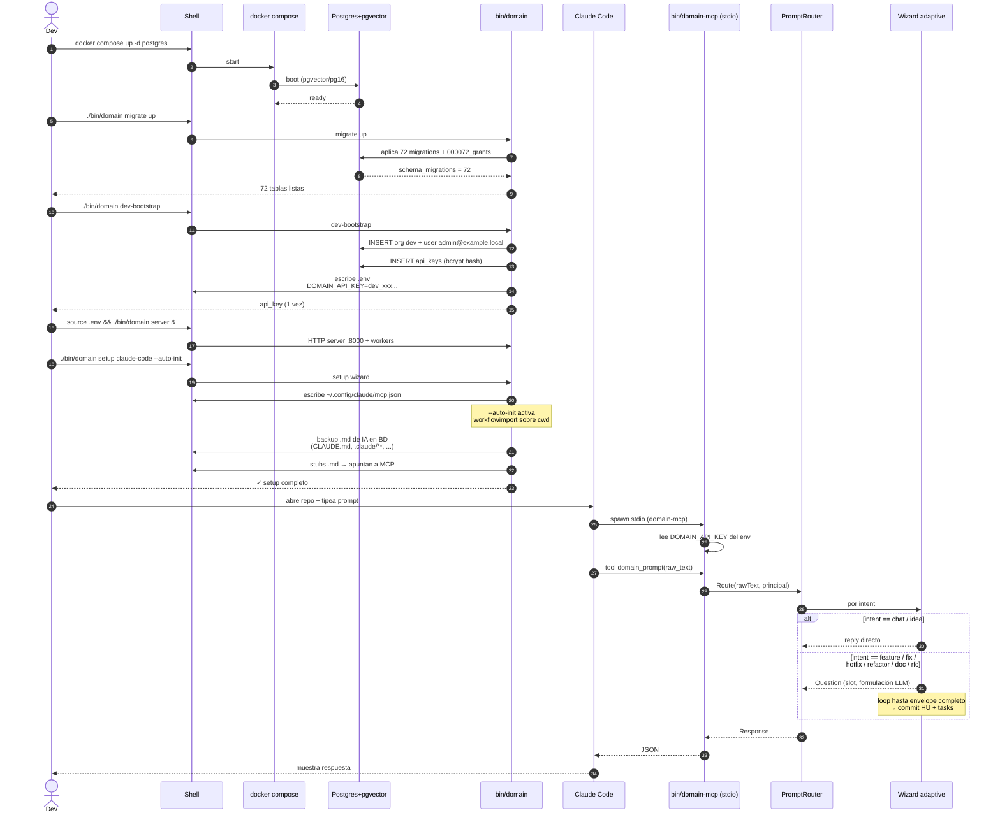
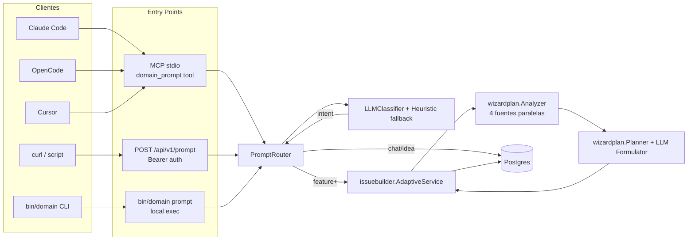
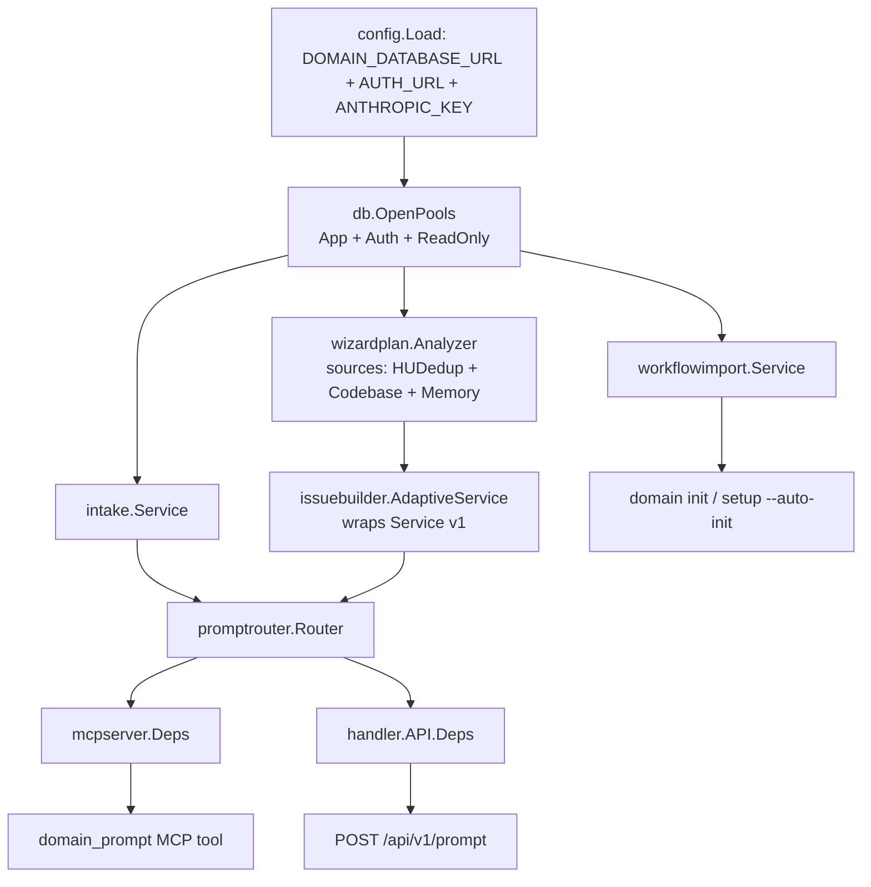

# Flow: setup plug-and-play end-to-end

Desde repo vacío hasta primer prompt funcionando en <5 min. Incluye los
3 puntos de entrada (MCP stdio, HTTP `/api/v1/prompt`, CLI directo).

## Secuencia: instalación + primer prompt



## Tres puntos de entrada equivalentes



## Componentes wire-up en runtime

Wire-up real en `cmd/domain/main.go::runServer()` y
`cmd/domain-mcp/main.go::main()`:



## Asserts BD post-setup

```sql
SELECT slug, name FROM organizations WHERE slug = 'dev';
-- (1 row)

SELECT email FROM users WHERE email = 'admin@example.local';
-- (1 row)

SELECT key_prefix, name FROM api_keys
WHERE name LIKE 'dev-bootstrap-%' AND revoked_at IS NULL;
-- (1 row, key_prefix visible)

SELECT version, dirty FROM schema_migrations;
-- 72, false

SELECT COUNT(*) FROM platform_policies WHERE active = true;
-- 10 (PlatformPoliciesSeeder)

SELECT COUNT(*) FROM model_registry;
-- 15 (ModelRegistrySeeder)
```

Tests: `tests/e2e/full_flow_test.go::TestE2E_PlugAndPlay_HappyPath`.
