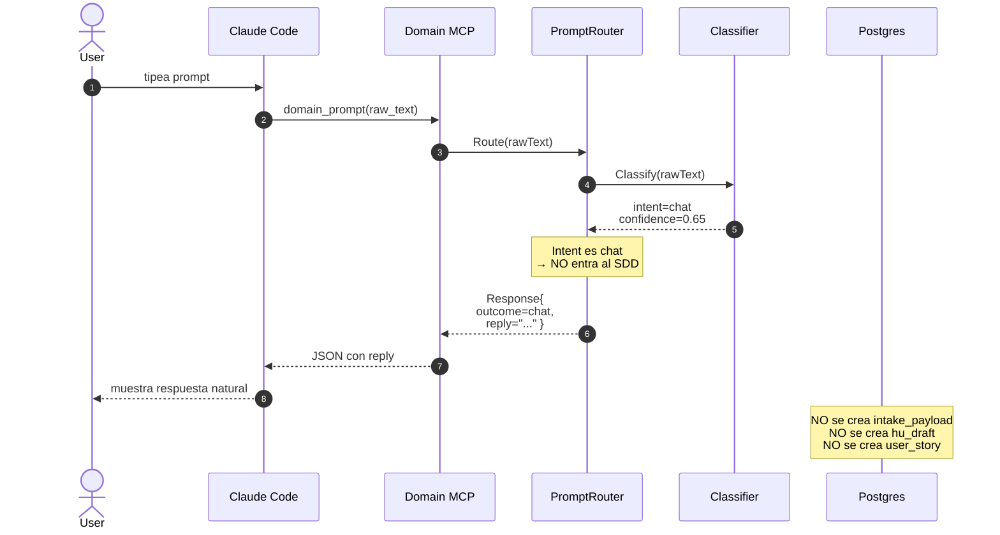

# Flow: `chat` — respuesta directa sin SDD

El usuario hace una pregunta conversacional ("¿cómo se configura X?").
Domain MCP responde directo, NO entra al wizard.

## Ejemplo de prompt

> "¿Cómo se configuran las migrations de postgres en este proyecto?"

## Secuencia



## Asserts BD post-flow

```sql
-- Después de un prompt clasificado como chat:
SELECT COUNT(*) FROM intake_payloads;  -- 0
SELECT COUNT(*) FROM issue_drafts;        -- 0
SELECT COUNT(*) FROM issues;     -- 0 (no se materializó nada)
```

## Por qué importa

Sin esta rama, el wizard se dispararía por cada pregunta y agotaría
paciencia del usuario. El router actúa como **gate**: solo trabajo
estructurado (feat/fix/etc) atraviesa el SDD.

Tests: `TestIssueType_Chat_SkipsWizardAndReplies` en
`tests/e2e/issue_types_test.go`.
