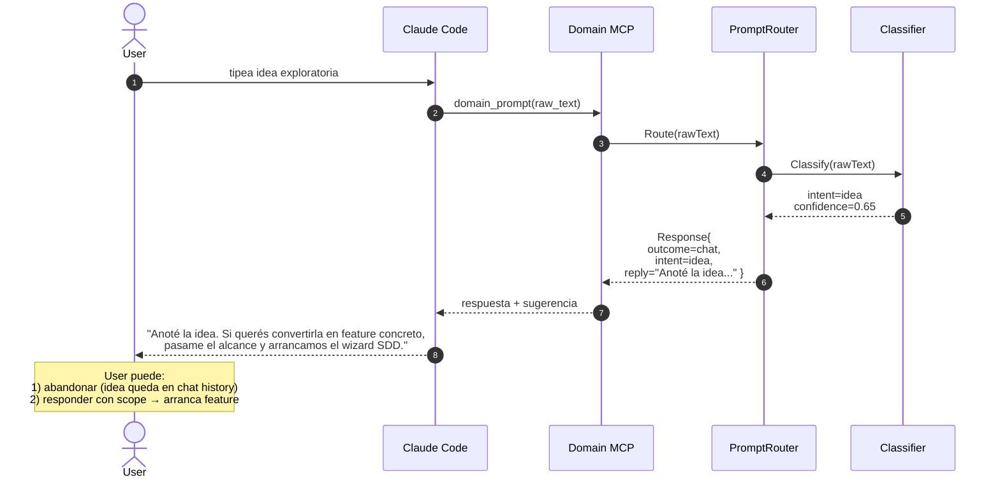

# Flow: `idea` — exploración sin compromiso

El usuario propone una idea (`"y si agregamos…"`, `"se me ocurre…"`).
Domain responde reconociendo la idea + opcionalmente ofrece materializarla.

## Ejemplo de prompt

> "Se me ocurre una idea: y si agregamos un modo TUI offline para ver
> agent_runs en consola."

## Secuencia

## Asserts BD

Igual que `chat`: ninguna fila nueva en intake/hu_drafts/user_stories.
La idea queda en el contexto conversacional del agente IA, NO en BD
estructurada.

## Diferencia con `feature`

Una idea sin compromiso de ejecución NO se materializa como HU. Para
convertir idea → feature, el usuario debe re-prompt con verbo de
implementación: "implementemos X", "necesito Y", "quiero Z".

Tests: `TestIssueType_Idea_SkipsWizardAndReplies`.
