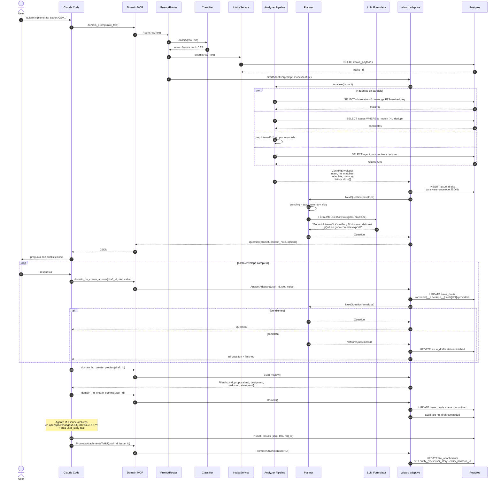

# Flow: `feature` — nueva capacidad

Implementar feature nueva. Wizard adaptive arranca con `mode=feature`.
El analyzer infiere lo que puede (audience, req_parent) y el planner
solo pregunta los slots faltantes.

## Ejemplo de prompt

> "Quiero implementar export de runs a CSV con streaming"

## Secuencia



## Asserts BD post-flow

```sql
-- 1) Intake registrado con classification
SELECT classified_type, classified_confidence
FROM intake_payloads
WHERE source='agent'
ORDER BY created_at DESC LIMIT 1;
-- Expected: ('feature', >= 0.5)

-- 2) Draft committed
SELECT status, mode FROM issue_drafts WHERE id = <draft_id>;
-- Expected: ('committed', 'feature')

-- 3) Envelope persistido completo en answers JSONB
SELECT jsonb_extract_path(answers, '__envelope__', 'slots') FROM issue_drafts
WHERE id = <draft_id>;
-- Expected: todos los slots con status in ('provided','inferred')

-- 4) user_story creada
SELECT slug, status FROM issues WHERE slug = '<suggested_slug>';
-- Expected: row con status='proposed' o 'approved'
```

## Slots típicos para mode=feature

| Slot | Inferible? | Fuente típica |
|---|---|---|
| intent | sí | classifier |
| audience | a veces | memory dedup |
| req_parent | a veces | hu_dedup FTS |
| goal | NO | user |
| summary | NO | user |
| slug | NO | user (o derivar post-summary) |

En promedio: **2-4 preguntas** vs 8 fijas del v1.

Tests: `TestIssueType_Feature_StartsAdaptiveWizard` +
`TestIssueType_Feature_WithHUDedup_InfersReqParent`.
