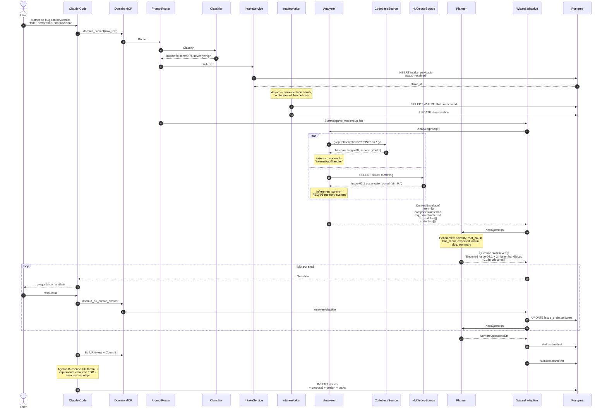

# Flow: `fix` — bug en producción / función rota

Wizard arranca con `mode=bug-fix`. Pregunta severity, root_cause,
expected/actual, etc. Cuando el analyzer detecta hits en código, sugiere
`affected_component` automáticamente.

## Ejemplo de prompt

> "El endpoint POST /api/v1/observations falla con error 500 al hacer
> click — no funciona el botón export"

## Secuencia



## Slots típicos para mode=bug-fix

| Slot | Inferible? | Fuente típica |
|---|---|---|
| intent | sí | classifier |
| severity | a veces | classifier (hotfix→critical) |
| component | a veces | code grep |
| root_cause | NO | user |
| has_repro | NO | user |
| expected | NO | user |
| actual | a veces | extract del prompt original |
| slug | NO | user / derivado |
| summary | NO | user |

## Asserts BD

```sql
-- Verifica classification
SELECT classified_type, classified_severity, classified_confidence
FROM intake_payloads
WHERE id = <intake_id>;
-- Expected: ('fix', 'high', >= 0.5)

-- Verifica draft con envelope serializado
SELECT mode, status,
       jsonb_extract_path(answers, '__envelope__', 'code', 'hits')
FROM issue_drafts WHERE id = <draft_id>;
-- Expected mode=bug-fix; code.hits con al menos 1 entry
```

Tests: `TestIssueType_Fix_PersistsClassificationAndDraft` +
`TestIssueType_FullHappyPath_FixWithCommit`.
