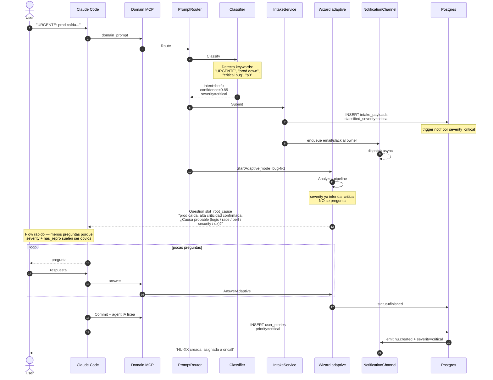

# Flow: `hotfix` — bug urgente / producción caída

Idéntico a `fix` pero con dos diferencias importantes:
1. **Severity defaulteada a `critical`** por el classifier (confidence ≥ 0.85).
2. **Notificaciones agresivas** al owner del HU (HU-20 notifications).

## Ejemplo de prompt

> "URGENTE: producción caída, todos los logins fallan, esto es critical bug"

## Secuencia



## Diferencias clave vs `fix` normal

| Aspecto | fix | hotfix |
|---|---|---|
| `classified_severity` | high (inferida) | **critical** (alta conf) |
| Notificación al crear intake | no | **sí** (email + slack) |
| Skip de pregunta severity | a veces | **siempre** (ya inferida ≥0.85) |
| Tareas async (workers) | normales | con priority boost |
| SLA | 24h | **<2h** |

## Asserts BD

```sql
SELECT classified_severity, classified_confidence
FROM intake_payloads
WHERE id = <intake_id>;
-- Expected: ('critical', >= 0.8)

-- Verifica notification dispatched
SELECT channel, recipient, status FROM notification_deliveries
WHERE event_type = 'intake.hotfix';
-- Expected: row con status='sent' o 'queued'
```

Tests: `TestIssueType_Hotfix_HighConfidenceCritical`.
