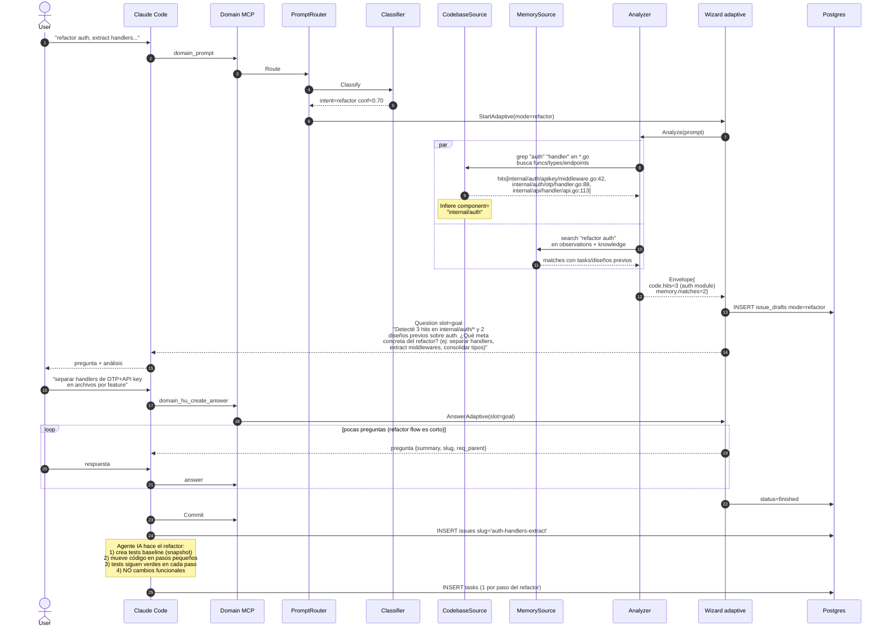

# Flow: `refactor` — mejora interna sin cambio funcional

Wizard arranca con `mode=refactor`. El analyzer hace énfasis en
**code grep** para identificar todos los call sites afectados; el
planner pregunta el alcance del refactor + invariantes a preservar.

## Ejemplo de prompt

> "Necesito refactor del módulo de auth para extract los handlers en
> archivos separados"

## Secuencia



## Slots típicos para mode=refactor

| Slot | Inferible? | Fuente típica |
|---|---|---|
| intent | sí | classifier |
| component | sí | code grep (paths afectados) |
| goal | NO | user (qué concreto quieren cambiar) |
| invariants_preserved | NO | user (qué NO debe cambiar) |
| slug | NO | user / derivado |
| summary | NO | user |

## Por qué refactor depende más de code grep

Una feature crea código nuevo; un refactor **mueve código existente**.
Sin saber dónde está el código actual, el agente IA no puede planear el
refactor. El CodebaseSource es esencial acá.

## Asserts BD

```sql
SELECT mode FROM issue_drafts WHERE id = <draft_id>;
-- Expected: 'refactor'

-- code.hits debe tener al menos 1 entry
SELECT jsonb_array_length(
  jsonb_extract_path(answers, '__envelope__', 'code', 'hits')
) FROM issue_drafts WHERE id = <draft_id>;
-- Expected: >= 1
```

Tests: `TestIssueType_Refactor_StartsCorrectMode`.
