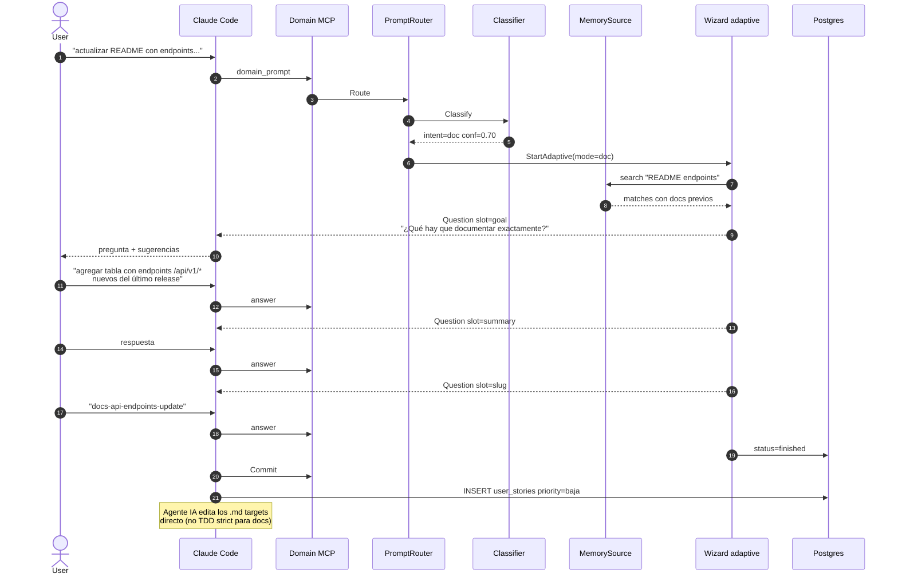

# Flow: `doc` — actualización de documentación

Wizard mínimo: pregunta target (qué archivo/sección) + qué cambio.
Sin tests, sin Gherkin extensos. La spec es lightweight.

## Ejemplo de prompt

> "Hay que actualizar la documentación del README con los nuevos endpoints"

## Secuencia



## Slots típicos para mode=doc

| Slot | Inferible? | Fuente típica |
|---|---|---|
| intent | sí | classifier |
| req_parent | a veces | memory match |
| goal | NO | user (qué sección documentar) |
| summary | NO | user |
| slug | NO | user / derivado |

Más cortito que feature porque NO necesita:
- audience (es para "developers" implícito)
- severity (no es bug)
- gherkin scenarios (docs no tienen criteria testeables formalmente)

## Asserts BD

```sql
SELECT mode, priority FROM hu_drafts
JOIN user_stories ON user_stories.slug = jsonb_extract_path_text(answers, 'slug')
WHERE hu_drafts.id = <draft_id>;
-- Expected: mode='doc', priority='baja' o 'media'
```

Tests: `TestIssueType_Doc_StartsCorrectMode`.
