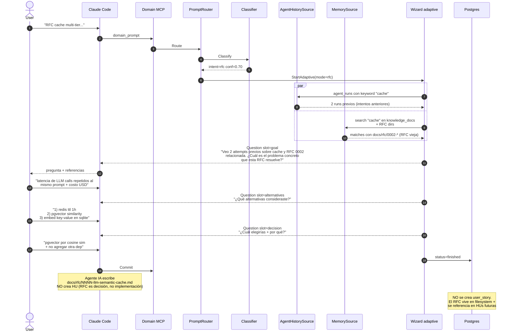

# Flow: `rfc` — decisión arquitectónica con tradeoffs

Wizard con `mode=rfc` pregunta por: problema a resolver, alternativas
consideradas, decisión + tradeoffs. Output va a `docs/rfc/NNNN-name.md`
(NO crea HU).

## Ejemplo de prompt

> "RFC: diseño arquitectura del nuevo sistema de cache multi-tier,
> tradeoffs entre redis vs pgvector"

## Secuencia



## Slots típicos para mode=rfc

| Slot | Inferible? | Fuente típica |
|---|---|---|
| intent | sí | classifier |
| goal | NO | user (problema a resolver) |
| alternatives | NO | user (al menos 2-3) |
| decision | NO | user (qué eligió) |
| tradeoffs | NO | user |
| summary | NO | user |
| slug | NO | user / derivado |

## Output del flow RFC

Diferencias clave vs feature/fix:

1. **NO crea user_story**. Sólo doc.
2. **NO entra a tasks.md**. Las tasks vendrán cuando una HU futura
   implemente la decisión del RFC.
3. **Numero NNNN auto-incrementado** desde el max(docs/rfc/[0-9]+).
4. **Status workflow**: `draft → accepted | rejected | superseded`.

## Asserts BD

```sql
SELECT mode FROM issue_drafts WHERE id = <draft_id>;
-- Expected: 'rfc'

-- NO debe haber user_story creado
SELECT COUNT(*) FROM issues
WHERE slug LIKE jsonb_extract_path_text(answers, 'slug') || '%';
-- Expected: 0 (las RFC no materializan en issues)
```

Tests: `TestIssueType_RFC_StartsCorrectMode`.
