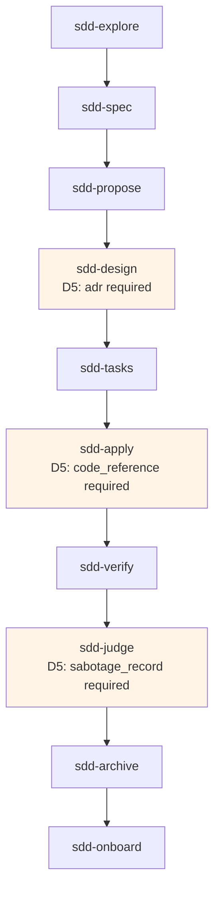
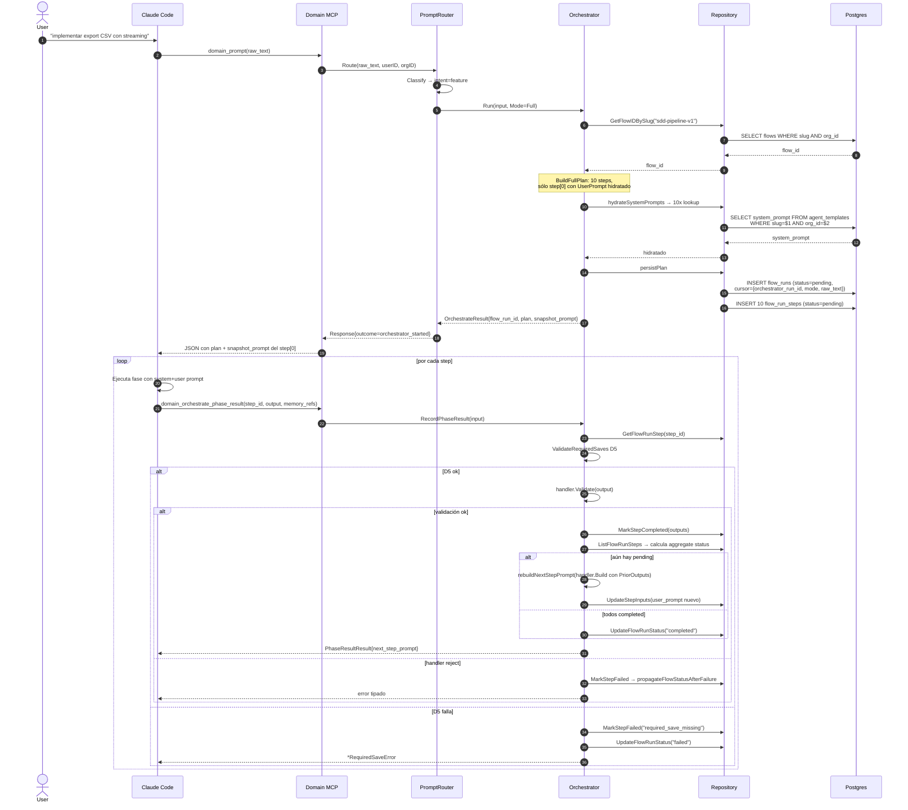
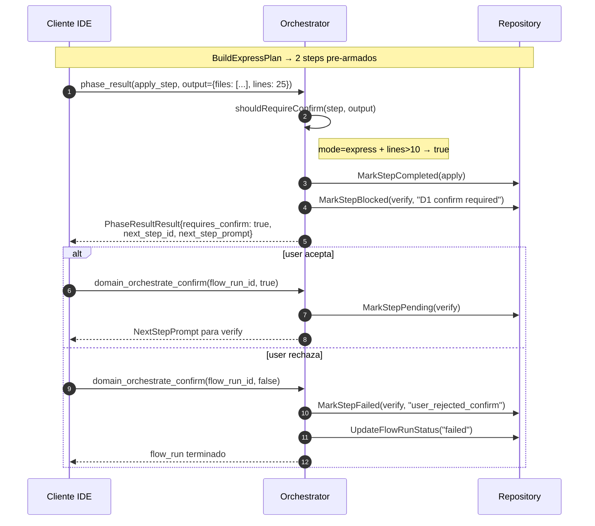
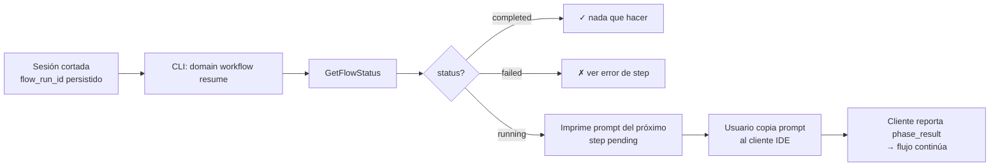

# Flow: SDD pipeline orchestrator (issue-08.10)

El orquestador SDD canaliza prompts `feature` / `fix` / `refactor` /
`hotfix` / `doc` / `rfc` desde `domain_prompt` a un pipeline gobernado de
10 fases (Full) o 2 fases (Express), ejecutadas por el cliente IDE con
estado persistido en `flow_runs` + `flow_run_steps`.

Ver guía completa en [`docs/agents/sdd-pipeline.md`](../agents/sdd-pipeline.md).

## DAG canónico

**Express** ejecuta sólo `sdd-apply` → `sdd-verify` (fast path D1).

## Secuencia Full mode end-to-end

## Path Express con D1 confirm condicional

## Reanudación cross-session

