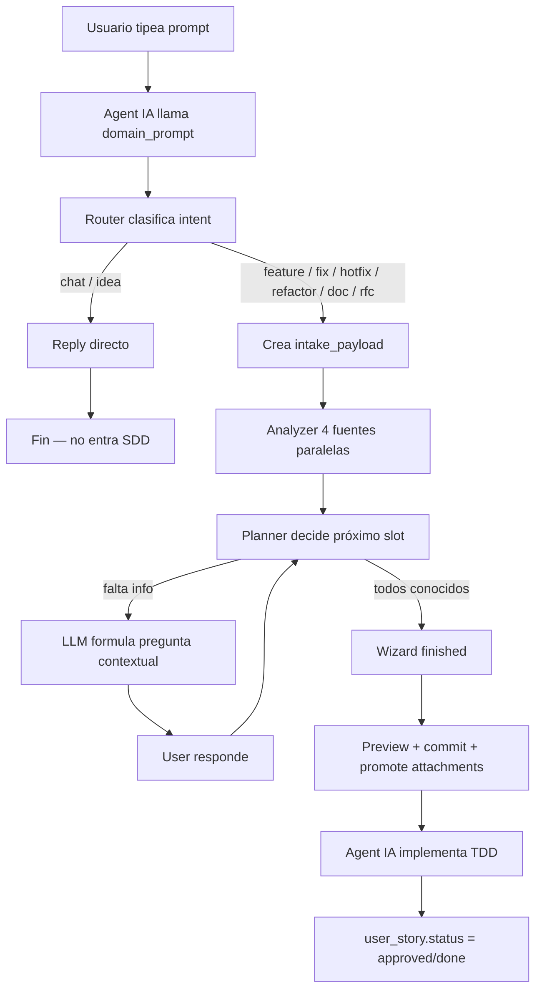
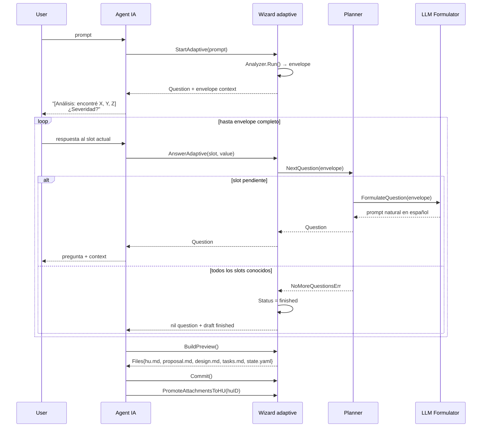

# Domain — Diagramas de Secuencia por Tipo de Issue

Estos diagramas Mermaid muestran el flow real plug-and-play de Domain
para cada tipo de issue. Renderean en GitHub, GitLab, VSCode (extensión
Markdown Preview Mermaid), Mermaid Live Editor.

| Intent | Diagrama | Wizard arranca | LLM real |
|---|---|:-:|:-:|
| [setup plug-and-play](./00-setup-plugplay.md) | install→bootstrap→init→prompt | — | — |
| [chat](./01-chat.md) | respuesta directa | ❌ | opcional |
| [idea](./02-idea.md) | respuesta + memoria | ❌ | opcional |
| [feature](./03-feature.md) | wizard adaptive | ✅ | sí (formulator) |
| [fix](./04-fix.md) | wizard mode=bug-fix | ✅ | sí |
| [hotfix](./05-hotfix.md) | wizard severity=critical | ✅ | sí |
| [refactor](./06-refactor.md) | wizard + code grep | ✅ | sí |
| [doc](./07-doc.md) | wizard mínimo | ✅ | sí |
| [rfc](./08-rfc.md) | wizard + history | ✅ | sí |

## Componentes que aparecen en todos los diagramas

| Actor / Componente | Qué hace |
|---|---|
| **User** | Tipea prompt en Claude Code / OpenCode / Cursor |
| **Agent IA** | Recibe el prompt; llama `domain_prompt` MCP tool |
| **Domain MCP** | Server stdio (`bin/domain-mcp`) que expone tools `domain_*` |
| **HTTP API** | Alternativo: `POST /api/v1/prompt` con `Bearer DOMAIN_API_KEY` |
| **Router** | `internal/service/promptrouter` — clasifica intent + decide outcome |
| **Classifier** | LLMClassifier (Anthropic Haiku) con fallback HeuristicClassifier |
| **Intake** | `internal/service/intake` — persiste raw prompt + classification |
| **Analyzer** | `internal/service/wizardplan` — pipeline 4 fuentes en paralelo |
| **Planner** | Decide qué slot preguntar próximo + LLM formula la pregunta |
| **Wizard** | `internal/service/issuebuilder` — state machine adaptive |
| **BD Postgres** | tablas: intake_payloads · issue_drafts · issues · entity_state_transitions |

## Vista general (router + sub-flows)

## Loop interno típico del wizard adaptive

