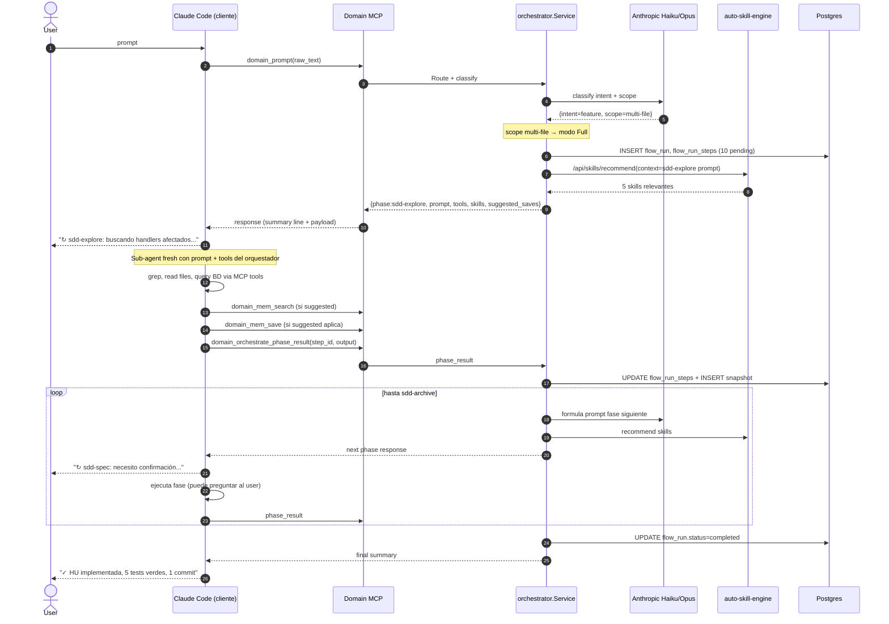

# RFC 0006 — SDD Pipeline Orchestrator

**Status:** draft
**Author:** nunezlagos
**Created:** 2026-06-10
**Supersedes:** —
**Targets HU:** HU-08.10 (pendiente de re-escribir tras este RFC)

## Resumen ejecutivo

Reemplazar el catálogo flat de 10 `agent_templates` por una jerarquía **1 orquestador thin + 9 phase-workers alineados a fases SDD**, manteniendo el modelo de ejecución actual donde **el cliente IDE (Claude Code / OpenCode / Cursor) ejecuta todo el trabajo real** y Domain server provee **state + LLM + memoria + skills**. Integrar con piezas existentes (`auto-skill-engine` HU-05.4, `crons` REQ-10, `flow_signals` REQ-09) en lugar de re-inventar.

## Motivación

Hoy el catálogo de 10 `agent_templates` tiene slugs rol-genérico (`researcher`, `coder`, `tester`, `supervisor`, ...). Funcionan como menú plano sin jerarquía. El patrón [gentle-ai](https://github.com/Gentleman-Programming/gentle-ai) demuestra que **alinear slug ↔ fase-SDD** (`sdd-explore`, `sdd-spec`, ...) da reproducibilidad mejor porque cada fase es un sub-agente con contexto aislado. Domain ya tiene infraestructura más rica que gentle-ai (BD persistente, `flow_signals`, `flow_run_step_snapshots`, `auto-skill-engine`, `crons`). Falta cablear todo eso en un orquestador coherente.

## Estado actual (verificado)

| Pieza | Ubicación | Estado |
|---|---|---|
| 10 `agent_templates` (researcher, coder, ...) | `internal/seeds/agent_templates_catalog.go` | implementado |
| `agent_runs.parent_run_id` + budget hierarchy | HU-08.6 multi-agent-supervisor | implementado |
| `flows` + `flow_runs` + `flow_run_steps` | REQ-09 | implementado |
| `flow_run_step_snapshots` (replay deterministic) | migration 000063 | implementado |
| `flow_signals` (pause/resume async) | REQ-09 | implementado |
| `saga_compensation_log` | REQ-09 | implementado |
| MCP tools `domain_mem_*` (save/search/context/get) | `internal/mcp/server/server.go:100-103` | implementado |
| Auto-skill engine (`POST /api/skills/recommend`) | HU-05.4 | implementado |
| Crons (user-defined) + scheduler con leader election | REQ-10 + `internal/scheduler/` | implementado |
| MCP resilience (timeout 5s + retry exponencial) | `internal/mcp/server/resilience.go` | implementado parcial |
| MCP circuit breaker + LRU cache | HU-12.6 design | **NO implementado** ❌ |
| Wizard adaptive (HU-04.7 v2) | `internal/service/hubuilder/adaptive.go` | implementado |
| PromptRouter | `internal/service/promptrouter/` | implementado |
| Workflow import (.md override) | `internal/service/workflowimport/` | implementado |

**Verificación crítica del modelo de ejecución:** todos los MCP tools en `internal/mcp/tools/*.go` son **data-only**: query a BD, embed/LLM call, search vectorial. **Cero** `os.Open` / `exec.Command` / filesystem writes / test runners. El cliente IDE ejecuta todo lo que toca workspace.

## Principio rector

> **Domain server = state machine + LLM + memoria + skills**.
> **Cliente IDE = ejecutor real** (bash, edit, test, commit, grep workspace).

NO cambia el modelo de ejecución existente. Lo extiende con una state machine que cubre 10 fases en lugar del wizard + commit aislados que existen hoy.

## Los 11 requerimientos

### 1. Complexity gate previo — modo Express

Antes del pipeline completo, el `LLMClassifier` devuelve no sólo `intent` sino `estimated_scope`:

| scope | modo aplicado | fases |
|---|---|---|
| `single-line` (typo, rename trivial) | Express | sdd-apply + sdd-verify (2 fases) |
| `single-file` | Express | sdd-spec mini + sdd-apply + sdd-verify (3 fases) |
| `multi-file` | Full | 10 fases completas |
| `multi-module` | Full + confirm | 10 fases pero pausa antes de sdd-apply para approval humano |

Justificación: hoy un "fix typo" entra al wizard que pregunta 3-5 cosas. Express salta directo. Mejora UX sin perder TDD-strict (`sdd-verify` sigue ahí).

### 2. State server + execution client (corrige error conceptual previo)

| Responsabilidad | Dónde corre |
|---|---|
| Decidir qué fase sigue | server-side (orquestador, cómputo puro) |
| Formular prompt para la fase actual | server-side (LLM) |
| Persistir state + snapshots | server-side (BD) |
| Sugerir qué tools usar | server-side (response al cliente) |
| Sugerir qué guardar en memoria | server-side (`suggested_saves`) |
| **Ejecutar grep, lectura archivos workspace** | **cliente IDE** |
| **Ejecutar bash, tests, git, edits** | **cliente IDE** |
| **Llamar `domain_mem_save/search`** | **cliente IDE** (cliente decide cuándo) |

El orquestador devuelve a cada turno: `{ phase, prompt, tools_available, suggested_saves, expected_outputs }`. Cliente IDE ejecuta. Reporta resultado via `domain_orchestrate_phase_result(flow_run_step_id, output, memory_refs_saved)`. Server avanza state machine.

### 3. Resume cross-session

Hoy si el cliente IDE pierde contexto (compaction, sesión cerrada) → flow zombi en BD. Necesario:

- MCP tool nuevo: `domain_flow_status(flow_run_id?)` → lista flows activos del usuario con `paused_awaiting_*` o `running` sin heartbeat reciente
- CLI nuevo: `./bin/domain workflow resume <flow_run_id>` que prepara el cliente IDE para retomar (devuelve el último state + siguiente prompt)
- Hint al iniciar conversación: si hay flows pendientes, el cliente IDE puede preguntar al user "tenés HU-XX en sdd-design pausado desde 2 días — querés retomar?"

### 4. Dual output (verbose BD + summary IDE)

Cada fase emite 2 outputs:

- **Verbose**: payload completo (decisiones, intermediate LLM thoughts, embeddings) → `flow_run_step_snapshots.output` JSONB
- **Summary**: 1 línea concisa para el chat del IDE

El MCP tool response al IDE contiene **sólo el summary**. Verbose queda en BD para debug / audit / cron de auditoría. UX limpia.

Ejemplo:
```
✓ sdd-explore        encontré 3 handlers afectados, 2 HUs relacionadas    (server, 1.2s)
✓ sdd-spec           respondiste: scope=handler único, anti-enum=N/A      (interactivo, 18s)
✓ sdd-propose        proposal v1 generada (153 líneas)                    (server, 2.1s)
↻ sdd-design         generando ADRs...                                    (en progreso)
```

### 5. Retry policy explícita por phase

Cada `agent_templates.metadata` declara su `retry_policy`:

| Política | Comportamiento al retry |
|---|---|
| `idempotent` | Re-corre la fase desde cero, sobreescribe snapshot. Default para sdd-explore, sdd-onboard. |
| `re-emit` | Usa el output del snapshot anterior (no re-LLM). Default para sdd-archive. |
| `require-cleanup` | Antes de re-correr, ejecuta saga compensation (rollback parcial). Default para sdd-apply (rollback commit), sdd-tasks (delete tasks creadas). |

Documentado en `flow_run_step_snapshots.retry_count` + `saga_compensation_log`.

### 6. Intent `analysis` (nuevo, no entra a SDD)

PromptRouter detecta intents que NO son chat ni feature/fix, sino **análisis read-only**: *"¿cuántos endpoints tienen RBAC?"*, *"¿qué HUs tocan la tabla X?"*. Mini-pipeline:

1. `analysis-explore` (sub-agent ejecuta queries en BD + grep en workspace via cliente IDE)
2. `analysis-write-doc` (genera markdown estructurado)

Output: `knowledge_doc` persistente + `observation` searchable. Resultado para el user es el doc renderizado. **Diferencia con `chat`:** persiste, indexable, citable en HUs futuras.

### 7. Multi-concern detection en sdd-explore

Si `sdd-explore` detecta múltiples concerns separables en el prompt, propone split:

```
Detecté 2 changes separables en tu prompt:
  1. RBAC en POST /agents (req-02 scope)
  2. rate-limit en GET /reports (req-13 scope)

¿Cómo procedo?
  (a) 2 flows separados (recomendado, mantiene HUs atómicas)
  (b) 1 flow con 2 HUs hijas
  (c) sólo el #1 ahora, el #2 después
```

Detectable via LLM clasificación + dedup en BD (FTS sobre `user_stories.slug` + `requirements.slug`).

### 8. HU-12.6 completa + heartbeat-watcher como **dependencia bloqueante**

Sin esto, un MCP externo colgado deja `flow_run_steps` zombis. Pre-requisitos:

- **HU-12.6 finalizar:** agregar circuit breaker (`sony/gobreaker` o equivalente) + LRU cache. Hoy sólo hay rate limiter + retry.
- **Nueva HU-08.11 heartbeat-watcher (system cron):** cron que corre cada 60s y detecta `flow_run_steps` con `status='running'` + `last_heartbeat_at < NOW() - 5min`. Los marca como `status='failed'` con razón `'heartbeat_timeout'` + dispara `saga_compensation_log`.
- **Nueva HU-08.12 orphan-runs-audit (system cron):** cron diario que cuenta `agent_runs` con `flow_run_id IS NULL` sin flag `standalone`. Incrementa métrica `domain_agent_runs_orphan_total`.

Ambos crons se registran en `system_crons` (NOT `crons` user-defined) — separación clave: user-defined disparan workflows del user, system gestiona salud interna.

### 9. Suggested-saves contract (preserva modelo memory-explícito)

Hoy memoria es 100% explícita: el cliente IDE llama `domain_mem_save` cuando quiere. Mantener eso.

El orquestador AGREGA: en cada fase, sugiere qué cosas vale guardar. El cliente IDE decide ejecutar o no.

```jsonc
// response del orquestador
{
  "phase": "sdd-design",
  "prompt": "...",
  "tools_available": [...],
  "suggested_saves": [
    {
      "type": "decision",
      "topic": "rbac-strategy",
      "content_hint": "trade-off 403 vs 404 anti-enum + decisión final"
    },
    {
      "type": "code-reference",
      "topic": "rbac-middleware-location",
      "content_hint": "internal/api/middleware/rbac.go ya existe (HU-02.2)"
    }
  ]
}
```

El cliente IDE puede:
- (a) ejecutar `domain_mem_save` con el contenido real para cada suggestion
- (b) ignorar las que no apliquen
- (c) agregar saves no sugeridas

Mantiene flexibilidad sin perder estructura.

### 10. Auto-skill integration (HU-05.4 ya implementada)

Por cada fase, el orquestador **antes** de devolver el prompt al cliente IDE, llama internamente a `POST /api/skills/recommend` con `{context: prompt_fase, top_n: 5, threshold: 0.6}`. Inyecta los skills resultantes en el response:

```jsonc
{
  "phase": "sdd-apply",
  "prompt": "...",
  "tools_available": ["domain_mem_search", "domain_mem_save"],
  "skills_recommended": [
    {"slug": "go-test-runner", "relevance": 0.92, "description": "..."},
    {"slug": "git-commit-conventional", "relevance": 0.87, "description": "..."}
  ],
  "suggested_saves": [...]
}
```

El sub-agent del cliente IDE sabe **qué tools especializados aplicar sin tener que buscar manualmente**. Reduce verbose y errores. Cero código nuevo: HU-05.4 ya hace el trabajo, el orquestador solo lo consume.

### 11. Cron interno como mecanismo de salud + triggers user-side

Domain tiene 2 niveles de cron — **separación crítica** que el orquestador respeta:

**System crons** (`internal/scheduler/cron/system/`) — operacionales internos, no visibles al user:
- `heartbeat-watcher` (cada 60s) — detecta flow_runs stuck (ver punto 8)
- `orphan-runs-audit` (diario) — métrica de bypass del enforcement
- `async-timeout-watcher` (cada 5min) — flow_runs en `paused_awaiting_*` > `timeout_at` → cancelar con razón
- `flow-runs-gc` (semanal) — purge flow_runs > 90 días con status terminal

**User crons** (`crons` tabla, REQ-10) — el user puede registrar:
```
"todos los lunes 9am, corre sdd-judge sobre los commits de la semana pasada"
→ INSERT INTO crons (cron_expression='0 9 * * 1', target_type='flow', target_id=<sdd-pipeline-v1>, inputs={ ... })
```

El scheduler ya existente (leader election en `internal/scheduler/leader/`) ejecuta ambos. El orquestador no necesita lógica de cron propia — consume scheduler.

## Modelo de ejecución (paso a paso)



## Out of scope

- Implementar HU-12.6 circuit breaker — es dependencia pero spec separado
- Implementar `heartbeat-watcher` cron — HU-08.11 separada
- Cambiar el wizard adaptive existente (HU-04.7 v2) — el orquestador lo invoca, no lo reemplaza
- Cambios destructivos al schema BD — sólo 1 migration aditiva (`agent_templates.role`)
- Renombrar tools MCP existentes — todos siguen igual
- Soportar agentes externos (LangGraph, AutoGen) — fuera de scope este RFC
- Web UI para visualizar flows — fuera de scope (HU futura)

## Dependencias bloqueantes (orden de implementación)

1. **HU-12.6 finalizar** (circuit breaker + LRU cache) — crítico para producción
2. **HU-08.11 heartbeat-watcher cron** (system cron) — sin esto los flows pueden quedar zombis
3. **HU-08.12 orphan-runs-audit cron** (system cron) — necesario para enforcement híbrido
4. **HU-08.10 sdd-pipeline-orchestrator** (este RFC) — desbloqueado tras 1-3

Sin las 3 dependencias, el orquestador puede arrancar pero NO es prod-ready.

## Preguntas abiertas para el usuario

1. **Modo Express:** ¿`single-line` salta directo a sdd-apply sin pedir confirmación, o siempre confirma antes? Mi default: confirm si afecta files con > N líneas modificadas.
2. **Multi-concern UX:** cuando se detectan 2 concerns, ¿el orquestador propone interactivo (espera respuesta) o auto-asume opción (a) 2 flows separados? Mi default: interactivo solo si scope > single-file; si todos son small, auto-split sin preguntar.
3. **Auto-skill threshold:** `0.6` es default razonable o muy permisivo? Si baja a 0.5 inyecta demasiados skills irrelevantes; si sube a 0.7 puede no devolver nada útil.
4. **Cron user-defined disparando flows del orquestador:** ¿queremos que un cron pueda gatillar `sdd-pipeline-v1` con un prompt fijo? Caso de uso: cron semanal "audita seguridad de los handlers tocados esta semana". Si sí, ¿el cron pasa por PromptRouter o entra directo al orquestador?
5. **`suggested_saves` priority:** ¿el orquestador marca algunas como `required: true` (el cliente DEBE guardarlas) vs `optional`? Riesgo: si todo es opcional, el cliente puede no guardar nada y se pierde contexto cross-fase.
6. **Express + Async:** ¿son compatibles? Un fix single-file no debería pausar nunca. Mi default: Async sólo disponible para modo Full y Detect.
7. **Intent `analysis` privacy:** los `knowledge_doc` que genera, ¿son privados al user que pidió, o accesibles a toda la org? Default mío: scope org pero con `created_by` visible.

## Próximos pasos

Si este RFC se aprueba:

1. Decidir las 7 preguntas abiertas → este doc se actualiza a `accepted`
2. Re-escribir `HU-08.10/hu.md` con los 11 puntos + escenarios Gherkin actualizados
3. Crear `HU-08.11-heartbeat-watcher-cron` (system cron)
4. Crear `HU-08.12-orphan-runs-audit-cron` (system cron)
5. Verificar prioridad de HU-12.6 — si está in_progress o necesita kickoff
6. Implementar en orden 12.6 → 08.11 → 08.12 → 08.10

## Referencias

- [gentle-ai](https://github.com/Gentleman-Programming/gentle-ai) — patrón inspirador (1 orquestador + N phase-workers)
- HU-04.7 v2 wizard adaptive — `openspec/changes/REQ-04-opsx-sdd/HU-04.7-wizard-adaptive/`
- HU-05.4 auto-skill-engine — `openspec/changes/REQ-05-skill-system/HU-05.4-auto-skill-engine/`
- HU-08.5 agent-templates — `openspec/changes/REQ-08-agent-system/HU-08.5-agent-templates/`
- HU-08.6 multi-agent-supervisor — `openspec/changes/REQ-08-agent-system/HU-08.6-multi-agent-supervisor/`
- HU-12.6 mcp-tool-resilience — `openspec/changes/REQ-12-mcp-server/HU-12.6-mcp-tool-resilience/`
- REQ-09 flows + flow_signals
- REQ-10 cron-triggers + scheduler
